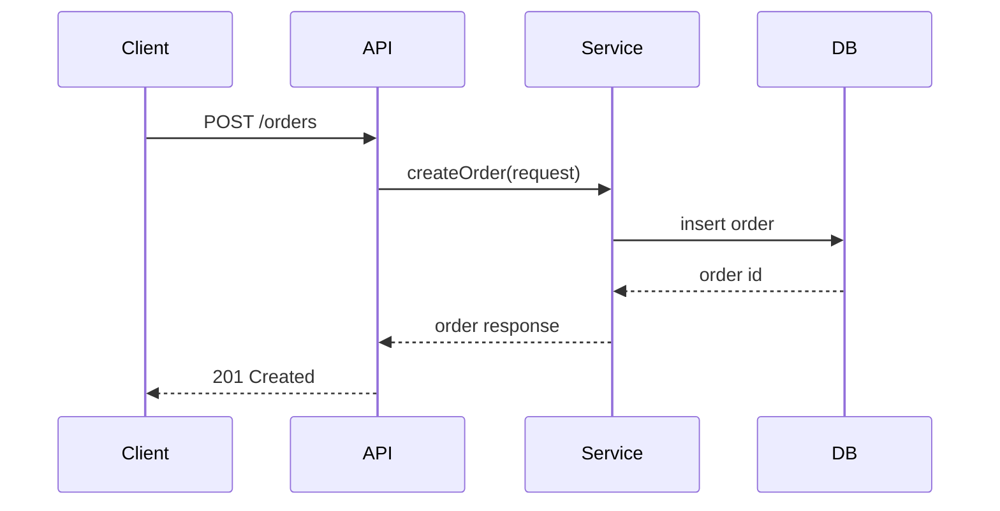
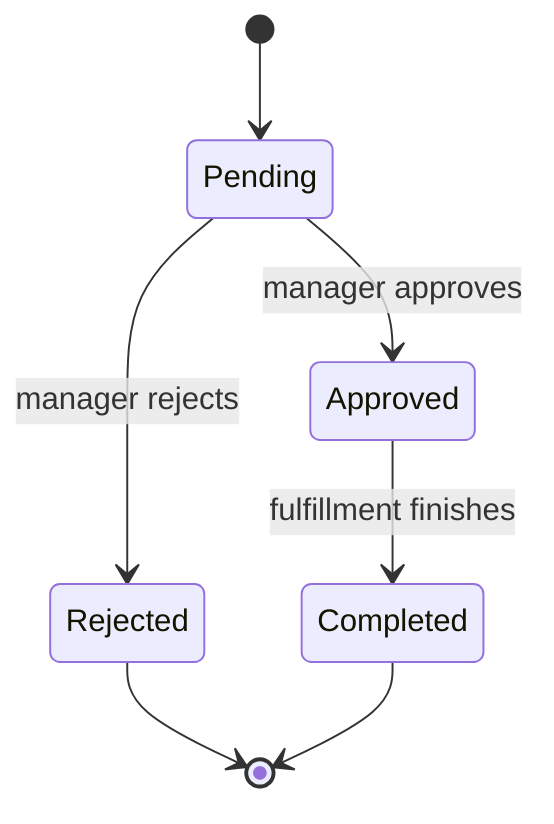

# Behavior, Flow, And Workflow Design

Use this reference for sequence diagrams, call flows, state transitions, and
workflow design.

## Flow Types

### Request / Call Flow

Use when explaining how a request travels through services.

Include:

- Entry point.
- Authentication and authorization.
- Validation.
- Service calls.
- Database or cache access.
- Events emitted.
- Response construction.
- Error paths.

### Sequence Diagram

Use when time ordering matters across actors or components.

Preferred Mermaid shape:

### State Machine

Use when an entity has lifecycle states.

Capture:

- States.
- Valid transitions.
- Triggering events.
- Guards or validation rules.
- Terminal states.
- Invalid transitions and error behavior.

Preferred Mermaid shape:

### Workflow

Use when the design spans people, systems, retries, approvals, or long-running
orchestration.

Cover:

- Workflow trigger.
- Steps and owners.
- Automatic vs manual actions.
- Timeouts and retries.
- Compensation or rollback steps.
- Audit requirements.
- What happens when a step fails.

## Output Guidance

For flows, show the happy path and at least one important failure path. If the
user asks only for diagrams, provide diagram source and a short explanation. If
the user asks for a full design, embed the flows inside the technical design.
