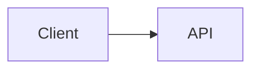

# Draft Diagrams

Draft, add, and modify clear, version-controlled technical diagrams from text. Keep this file as the router: choose the output format, read only the reference file for the requested diagram type, then produce concise diagram source that the user can paste into Markdown or keep beside code.

## Default Output Choice

Use Mermaid by default because it renders directly inside many Markdown tools and is easy to maintain in repositories.

Use PlantUML ASCII only when the user explicitly asks for ASCII, terminal-friendly output, plain text, PlantUML text mode, or a diagram that must work where Markdown rendering is unavailable.

If the user asks for a rendered image, first draft or update the editable source, then read `references/rendering-and-embedding.md` for export options.

## Route The Request

Load the smallest useful reference set:

| User needs | Preferred format | Read next |
| --- | --- | --- |
| Process, algorithm, workflow, user journey, deployment pipeline, decision tree | Mermaid flowchart | `references/mermaid-flowcharts.md` |
| API flow, request lifecycle, login flow, service interaction over time, code execution path | Mermaid sequence diagram | `references/mermaid-sequence.md` |
| UML class diagram, domain model, object model, code structure, inheritance, composition | Mermaid class diagram | `references/mermaid-class.md` |
| Database schema, table relationships, data model, primary/foreign keys | Mermaid ER diagram | `references/mermaid-erd.md` |
| System architecture, box diagram, service map, C4 context/container/component view, infrastructure | Mermaid architecture or C4 diagram | `references/mermaid-architecture-c4.md` |
| Lifecycle, finite state machine, status transitions, workflow states | Mermaid state diagram | `references/mermaid-state.md` |
| Terminal, email, code comment, README plain-text block, ASCII or Unicode diagram | PlantUML text mode | `references/plantuml-ascii.md` |
| Markdown embedding, `.mmd`/`.puml` files, PNG/SVG export, validation commands | Rendering/export guidance | `references/rendering-and-embedding.md` |

If the request spans multiple views, draft multiple focused diagrams instead of one overloaded diagram. For example, pair a C4 container diagram with a sequence diagram for the main request path.

## Diagram Drafting Workflow

1. Identify the audience and purpose: planning, documentation, review, onboarding, troubleshooting, or implementation guidance.
2. Choose one diagram question to answer. A useful diagram has a point of view, not every fact.
3. Pick the diagram type from the route table and read only the relevant reference file.
4. Extract names from the user's context or the codebase when available. Prefer real service, class, table, package, and endpoint names over generic placeholders.
5. Draft the diagram with a clear title, compact labels, and directional relationships.
6. Check syntax and readability before returning it. Look for invalid Mermaid identifiers, unescaped special characters, unbalanced blocks, and labels that are too long.
7. Include a short note explaining where the diagram fits and any assumptions that could affect correctness.

## Updating Existing Diagrams

When the user asks to modify an existing diagram:

1. Read the diagram source and the surrounding prose that explains it.
2. Identify the current format and diagram type before loading references.
3. Preserve the existing file format, style, naming conventions, and nearby documentation unless the user asks for a conversion.
4. Make the smallest clear edit that satisfies the requested design change.
5. Keep existing intent and relationships that are still true. Remove or rename only when the request or source context supports it.
6. Re-check the full diagram after editing, not only the changed lines.
7. Summarize what changed and call out any assumptions.

If an existing diagram is too overloaded to edit safely, propose splitting it into focused views and then update or add the smallest useful set of diagrams.

## Output Policy

When the user asks in chat, return a fenced code block unless they ask for a file:

````markdown

````

When editing a repository, prefer one of these file patterns:

- Inline Mermaid in an existing Markdown design doc when the diagram is part of prose.
- `docs/diagrams/<name>.mmd` for Mermaid source that should be rendered elsewhere.
- `docs/diagrams/<name>.puml` plus generated `.atxt` or `.utxt` for PlantUML ASCII output.

Keep source diagrams editable. Do not replace a maintainable source diagram with only a PNG/SVG unless the user explicitly requests image-only output.

## Quality Bar

- Keep each diagram focused enough to scan in under a minute.
- Use stable domain terms and real component names.
- Prefer left-to-right layouts for system/data-flow views and top-to-bottom layouts for procedural workflows.
- Use relationship labels that explain why two nodes connect.
- Split layers: context, container, component, sequence, and data model are separate concerns.
- Mark uncertain relationships as assumptions in prose instead of encoding guesses as facts.
- Avoid decorative styling unless the destination document benefits from it.
