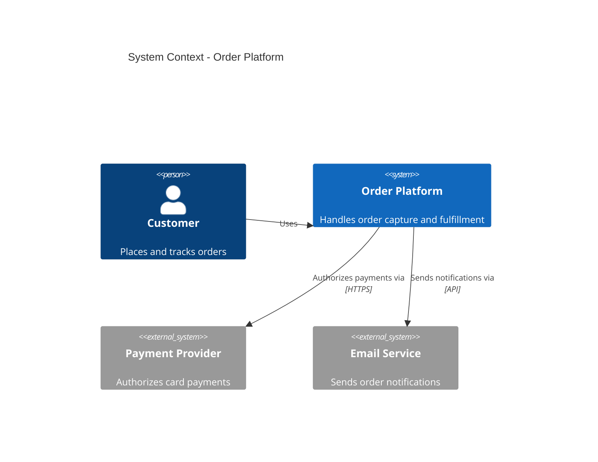
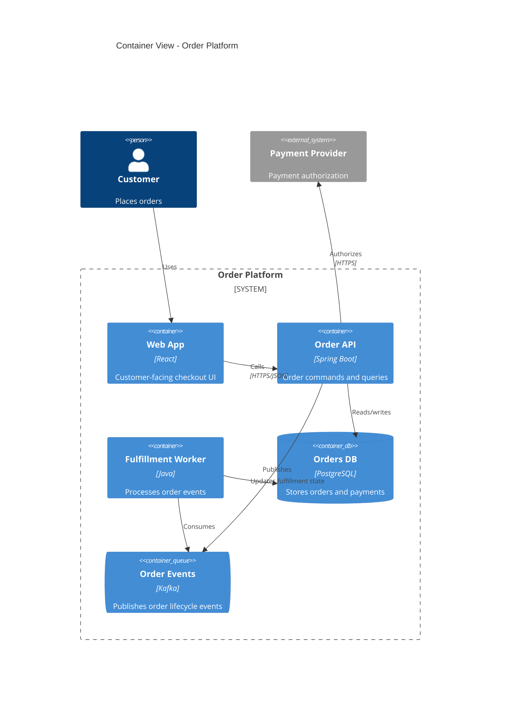
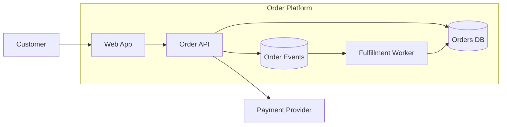
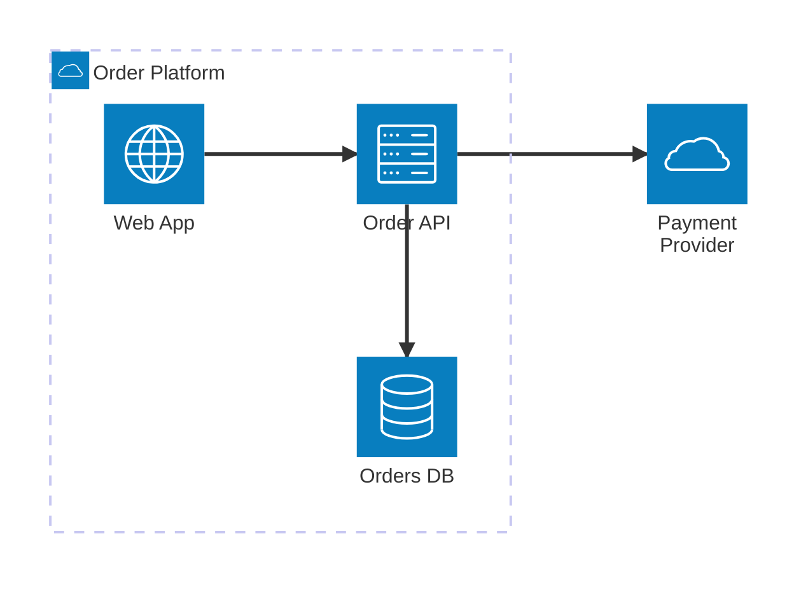

# Mermaid Architecture And C4 Diagrams

Use architecture and C4 diagrams for system structure, service boundaries, external dependencies, container/component views, and technical design documents.

## Choose A View

| View | Use when | Mermaid type |
| --- | --- | --- |
| System context | Show users, external systems, and the system under discussion | `C4Context` |
| Container | Show deployable apps, services, databases, queues, and clients | `C4Container` |
| Component | Show internals of one container or service | `C4Component` |
| Infrastructure or cloud layout | Show resources and network-ish connections | `architecture-beta` or `flowchart` |
| Simple box diagram | Need broad compatibility and predictable rendering | `flowchart LR` with subgraphs |

When in doubt, start with a C4 context or container view, then add a sequence diagram for the most important runtime flow.

## C4 Context

## C4 Container

## Simple Box Diagram With Flowchart

Use this when the target renderer does not support C4 Mermaid diagrams.

## Architecture-Beta

Mermaid `architecture-beta` can produce architecture-looking layouts, but support may vary by renderer version. Prefer C4 or flowchart when GitHub compatibility matters.

## Design Guidance

- Name boundaries after ownership or deployable systems.
- Label protocols and technologies only when they help reviewers make decisions.
- Keep context views free of implementation details.
- Keep component views scoped to one container or service.
- Use prose for non-visual details such as SLOs, scaling rules, data retention, and security controls.

## Pitfalls

- Do not mix context, container, and component detail in one view.
- Do not include every dependency if it distracts from the design decision.
- Check whether the target Markdown renderer supports C4 or `architecture-beta`; fall back to flowchart when compatibility matters.

