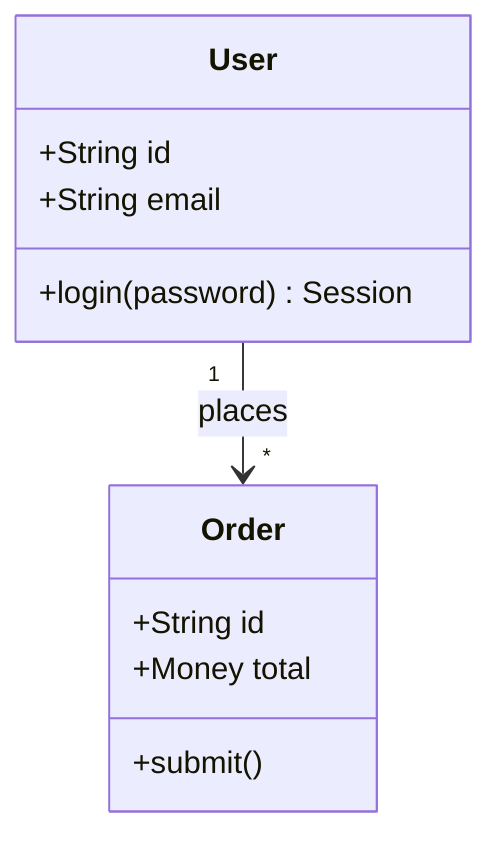
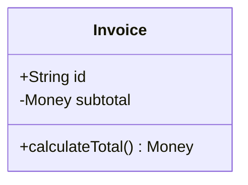
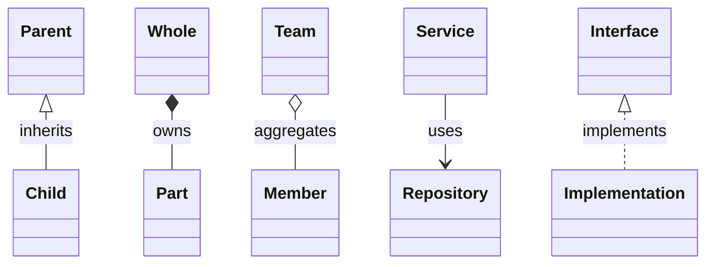

# Mermaid Class Diagrams

Use class diagrams for UML-style object models, domain models, code structure, public interfaces, inheritance, composition, and dependency relationships.

## Basic Shape

## Members

Visibility markers:

- `+` public
- `-` private
- `#` protected
- `~` package or internal

Member examples:

Keep members at the level needed for the user's task. For design docs, domain fields and important methods are usually enough.

## Relationships

Use relationship types carefully:

- `<|--` inheritance, "is-a".
- `*--` composition, strong ownership/lifecycle dependency.
- `o--` aggregation, weak ownership.
- `-->` dependency or navigable association.
- `<|..` implementation.

## Domain Modeling Guidance

- Prefer domain names over technical placeholders.
- Show invariants through relationships and multiplicities.
- Avoid dumping every class in a package. Choose the classes that explain the design decision.
- If persistence tables are the main concern, use an ER diagram instead.
- If runtime calls are the main concern, use a sequence diagram instead.

## Pitfalls

- Do not use composition unless the child cannot reasonably exist without the parent.
- Avoid mixing DTOs, database entities, service classes, and external APIs in one class diagram unless the goal is a mapping view.
- Mermaid class diagrams can become hard to read with many members; split by bounded context or module.

