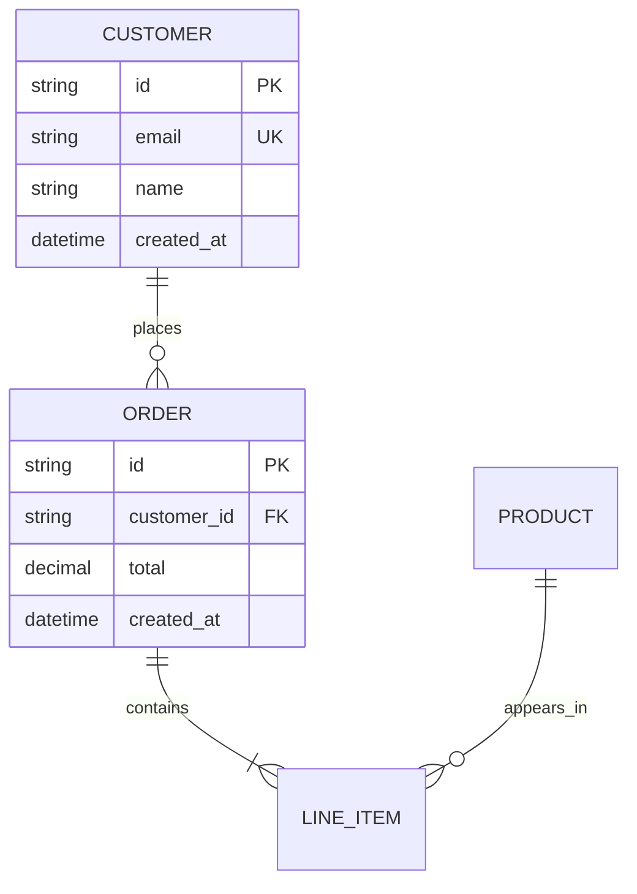
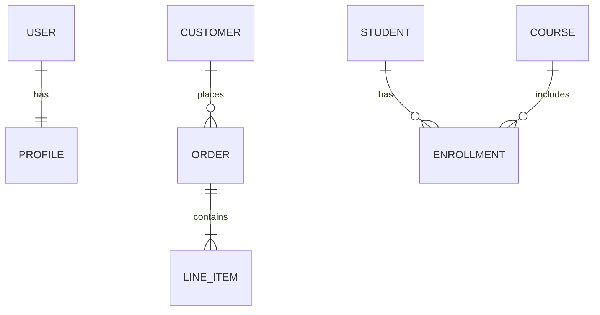

# Mermaid ER Diagrams

Use ER diagrams for database schemas, table relationships, join tables, cardinality, keys, and data model reviews.

## Basic Shape



## Cardinality

Common relationship markers:

- `||` exactly one
- `|o` zero or one
- `|{` one or many
- `o{` zero or many

Common examples:



Represent many-to-many relationships through an explicit join table when designing implementation schemas.

## Attributes

Attribute format:

```text
type name constraint
```

Common constraints:

- `PK` primary key
- `FK` foreign key
- `UK` unique key
- `NN` not null

Use implementation types when the database is known. Use conceptual types when designing before database selection.

## Design Guidance

- Show only entities relevant to the question.
- Include keys for implementation-oriented diagrams.
- Label relationships with verbs such as `places`, `contains`, `belongs_to`.
- Add notes in prose for indexes, partitioning, retention, and migration caveats; Mermaid ER syntax is limited for those details.

## Pitfalls

- Avoid ER diagrams for object inheritance or runtime message order.
- Avoid ambiguous many-to-many relationships without a join entity.
- Do not invent keys or constraints from thin context; state assumptions separately.

