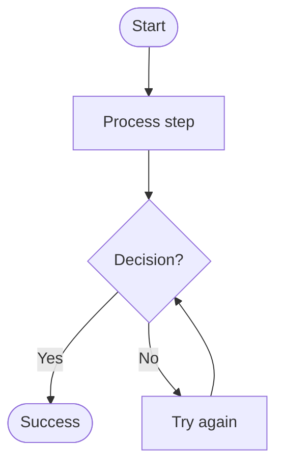
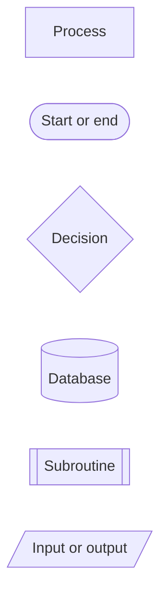
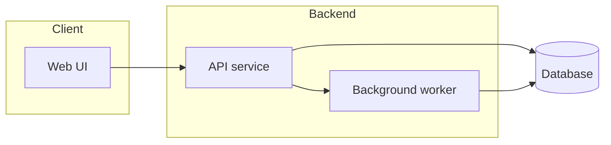

# Mermaid Flowcharts

Use flowcharts for processes, algorithms, decision trees, user journeys, data movement, and operational workflows. Flowcharts are best when the key question is "what happens next?"

## Basic Shape

Use `TD` for step-by-step procedures and `LR` for system or data movement.

## Common Node Shapes

Use shapes semantically, not decoratively:

- Rounded or stadium nodes for start/end.
- Rectangles for actions.
- Diamonds for decisions with labeled exits.
- Cylinders for stores such as databases, queues, caches, and files.
- Subroutine boxes for reusable or external processes.

## Subgraphs

Group related steps when ownership, runtime boundary, or system layer matters.

Keep subgraph names human-readable. Use subgraphs sparingly; too many boxes can hide the flow.

## Labeling Rules

- Label decision exits: `-->|Valid|`, `-->|Invalid|`.
- Use verbs for steps: "Validate token", "Write order", "Publish event".
- Use nouns for stores and components: "Orders DB", "Payment API".
- Keep labels short. Move long explanations into surrounding prose.

## Pitfalls

- Avoid punctuation-heavy node ids. Use simple ids such as `AuthCheck` and put the display text in brackets.
- Avoid trying to model time-based interactions with a flowchart; use a sequence diagram for message order.
- Avoid using a single flowchart for architecture, data schema, and lifecycle state. Split into focused diagrams.

