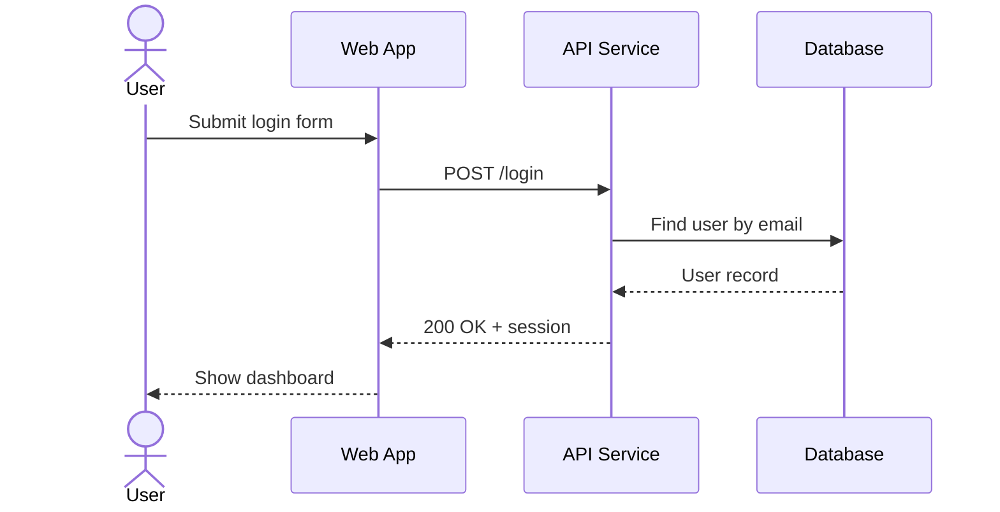
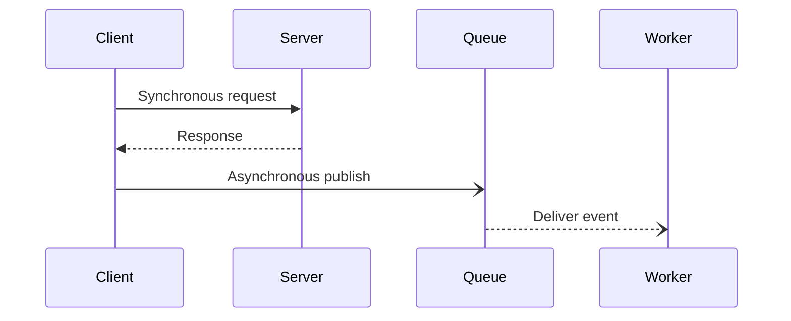
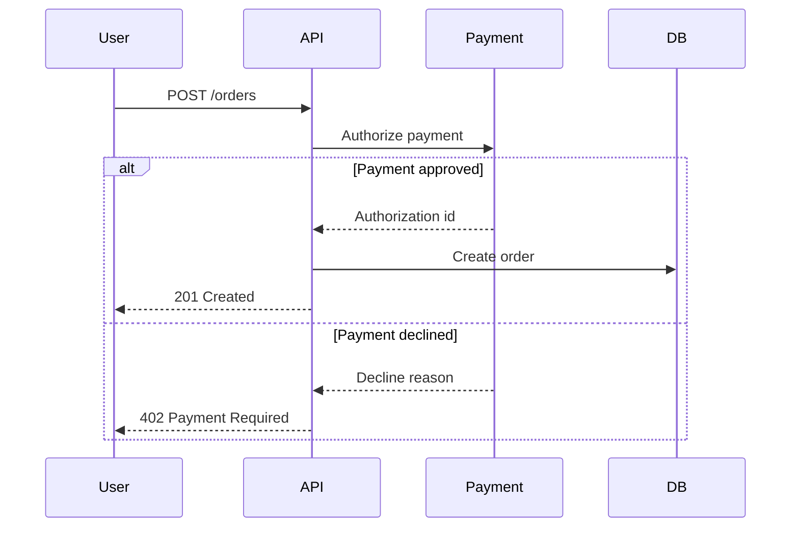
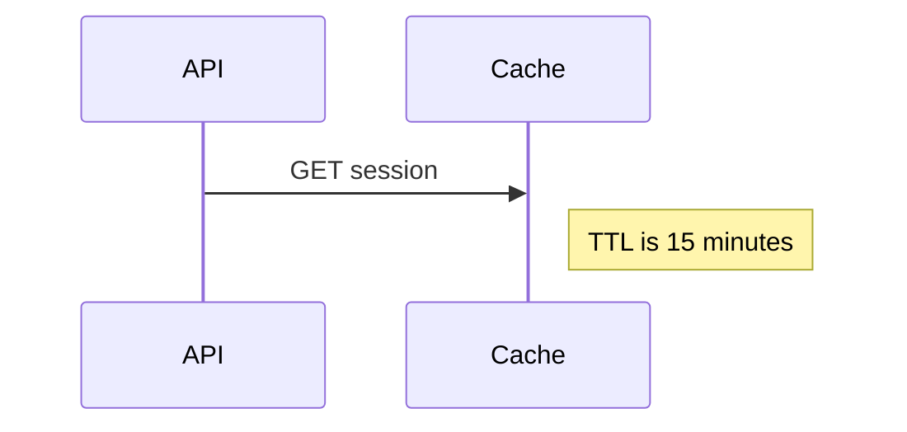

# Mermaid Sequence Diagrams

Use sequence diagrams when order over time matters: API calls, login flows, checkout flows, event publication, retries, callbacks, and method-level interactions.

## Basic Shape

Use `actor` for users or external people, and `participant` for systems, services, classes, or stores.

## Message Types

Prefer:

- `->>` for request/call.
- `-->>` for response/return.
- `-)` for asynchronous send.
- `--)` for asynchronous callback or event delivery.

## Control Blocks

Use control blocks to show meaningful alternatives, not every trivial branch.

Useful blocks:

- `alt` / `else` / `end` for alternatives.
- `opt` for optional behavior.
- `loop` for retry, polling, or batch processing.
- `par` for parallel work.

## Notes

Use notes to capture assumptions or non-obvious constraints.

## Pitfalls

- Do not turn a sequence diagram into an architecture inventory. Only include participants that exchange messages in this flow.
- Avoid long method names and payload dumps. Use concise intent labels.
- If the same service appears in many unrelated flows, create separate diagrams per scenario.

