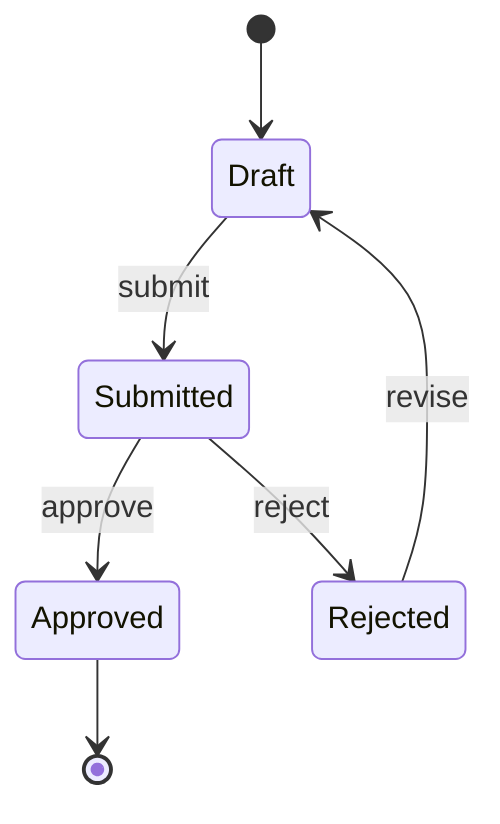
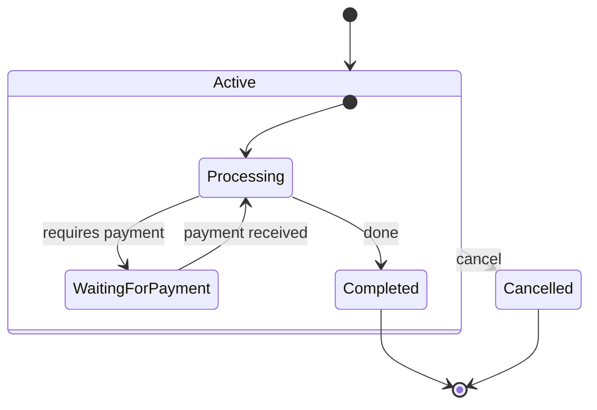

# Mermaid State Diagrams

Use state diagrams for lifecycle state, status transitions, finite state machines, approval flows, retry states, and object behavior where valid transitions matter.

## Basic Shape

## Composite States

Use nested states when a high-level state has internal behavior.

## Transition Labels

Prefer labels that identify the event or command causing the transition:

- `submit`
- `approve`
- `timeout`
- `payment_failed`
- `retry_limit_reached`

Use prose around the diagram for guards, permissions, and side effects when labels would become too long.

## Design Guidance

- Include every valid state in the lifecycle being discussed.
- Show terminal states explicitly with `[*]`.
- Keep state names noun/adjective-like, and transition labels verb/event-like.
- If actors or systems exchange messages, pair the state diagram with a sequence diagram.

## Pitfalls

- Do not model procedural steps as states unless they are durable states in the domain.
- Do not hide error/cancelled/expired states; they are often the reason the diagram is useful.
- Avoid encoding business rules in tiny transition labels. Put complex rules in prose or a table.

