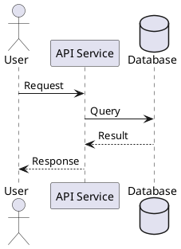
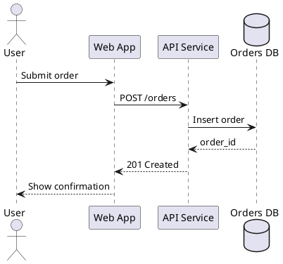
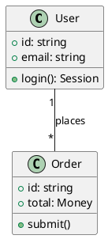
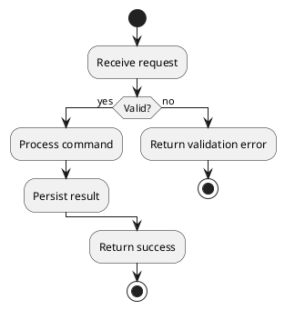
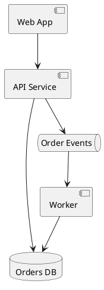

# PlantUML ASCII Diagrams

Use PlantUML text mode when the user needs a diagram that works in terminals, plain-text emails, code comments, changelogs, or other contexts where graphical rendering is not available.

PlantUML ASCII is best for compact sequence, class, activity, state, component, use case, and deployment diagrams. Complex diagrams can become hard to read in fixed-width text; suggest Mermaid or image export when the diagram grows.

## File Shape



## Generate Text Output

```bash
plantuml -txt diagram.puml
plantuml -utxt diagram.puml
```

Output files:

- `diagram.atxt` for pure ASCII.
- `diagram.utxt` for Unicode box-drawing output.

Prefer `-utxt` when the destination supports UTF-8 and fixed-width fonts. Prefer `-txt` for maximum portability.

## Useful Templates

Sequence:



Class:



Activity:



Component:



## Practical Guidance

- Keep labels short. Long labels break alignment and readability.
- Use aliases for names with spaces: `"API Service" as API`.
- Verify output in a fixed-width font before sharing.
- Use Mermaid when the diagram must render directly in Markdown.
- Use PlantUML source plus generated text output when the user wants both maintainability and copy-pasteable ASCII.

