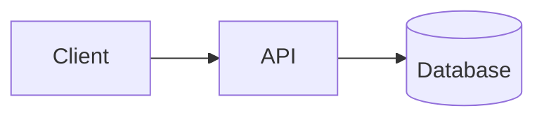

# Rendering And Embedding

Use this reference when the user asks how to place diagrams in Markdown, export images, validate syntax, or choose file formats.

## Markdown-Native Mermaid

Most repository documentation should use fenced Mermaid blocks:

````markdown

````

This keeps diagrams editable in pull requests and visible in Markdown renderers that support Mermaid.

## Source Files

Use source files when diagrams are large or shared across documents:

- `.mmd` for Mermaid.
- `.puml` for PlantUML source.
- `.atxt` or `.utxt` for generated PlantUML text output.
- `.svg` or `.png` only as rendered artifacts.

## Mermaid Export

Mermaid Live Editor:

- Open `https://mermaid.live`.
- Paste the Mermaid source.
- Export SVG or PNG.

Mermaid CLI:

```bash
npm install -g @mermaid-js/mermaid-cli
mmdc -i diagram.mmd -o diagram.svg
mmdc -i diagram.mmd -o diagram.png
```

Docker:

```bash
docker run --rm -v "$PWD:/data" minlag/mermaid-cli -i /data/diagram.mmd -o /data/diagram.svg
```

## PlantUML Text Export

```bash
plantuml -txt diagram.puml
plantuml -utxt diagram.puml
```

Use `-txt` for pure ASCII and `-utxt` for better-looking Unicode output.

## Validation Checklist

- The first Mermaid line is a valid diagram type such as `flowchart LR`, `sequenceDiagram`, `classDiagram`, `erDiagram`, `stateDiagram-v2`, `C4Context`, or `C4Container`.
- Code fences are balanced when embedding in Markdown.
- Node ids are simple and unique.
- Labels are short enough to render cleanly.
- The target renderer supports the selected diagram type. If not, use a flowchart fallback.
- Rendered images are generated from source files, not maintained by hand.

