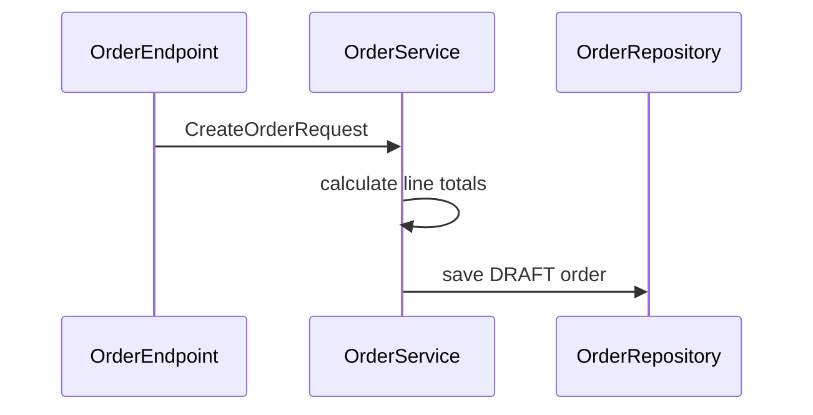
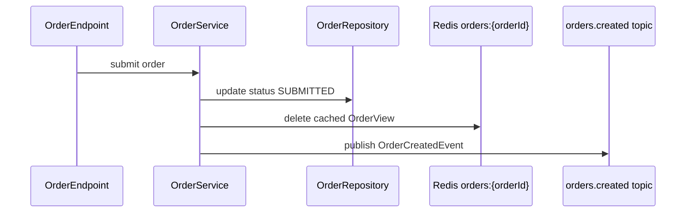
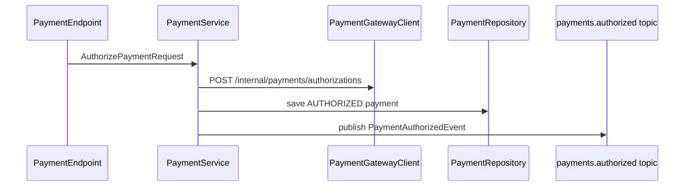
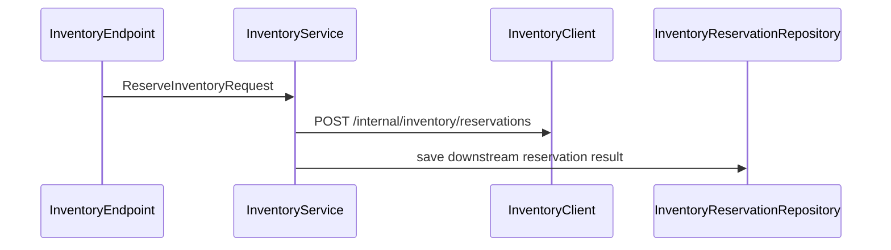
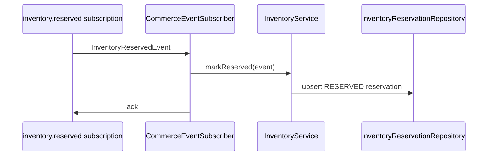
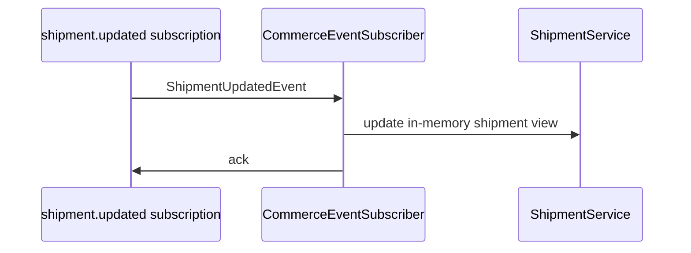
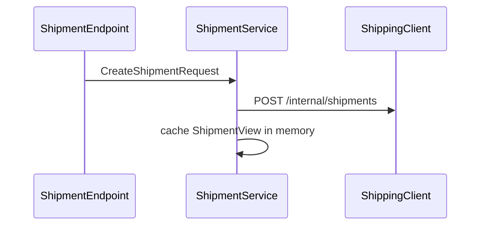
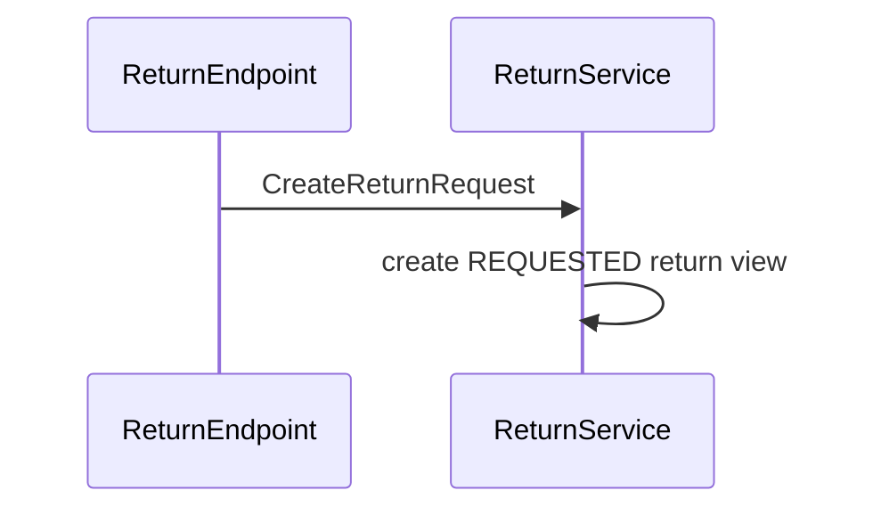
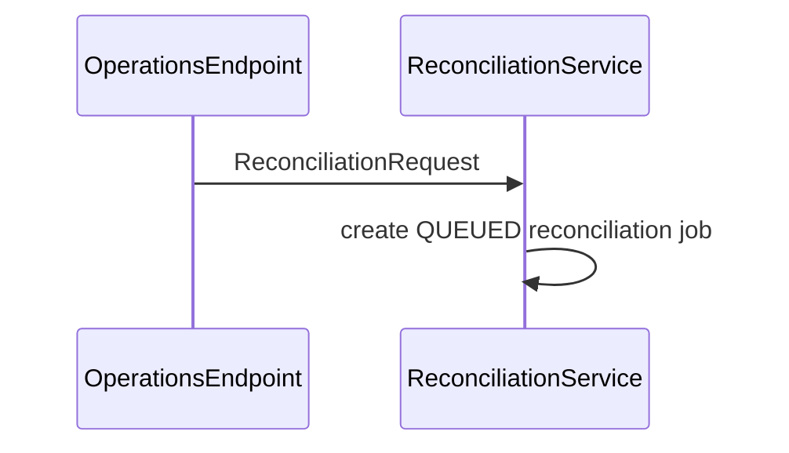

# Call Chains

Use these chains before changing behavior. Confidence is based on static source inspection and configuration evidence.

## POST /api/v1/orders

Confidence: `static`

Evidence:

- `endpoint/OrderEndpoint.java`
- `service/OrderService.java`
- `database/OrderRepository.java`

## POST /api/v1/orders/{orderId}/submit

Confidence: `static + config`

Change checklist:

- Update order status tests.
- Verify `order-created-topic` config in all envs.
- Keep `OrderCreatedEvent` backwards compatible or document consumer migration.

## POST /api/v1/payments/authorize

Confidence: `static + config`

Change checklist:

- Check `commerce.clients.payment.base-url` and timeout behavior.
- Update downstream error mapping tests before changing retry/capture semantics.
- Update payment event payload docs before adding fields.

## POST /api/v1/inventory/reservations

Confidence: `static + config`

## inventoryReservedInputChannel

Confidence: `static + pubsub`

## shipmentUpdatedInputChannel

Confidence: `static + pubsub`

## POST /api/v1/shipments

Confidence: `static + config`

## POST /api/v1/returns

Confidence: `static`

## POST /api/v1/operations/reconciliation/jobs

Confidence: `static`

