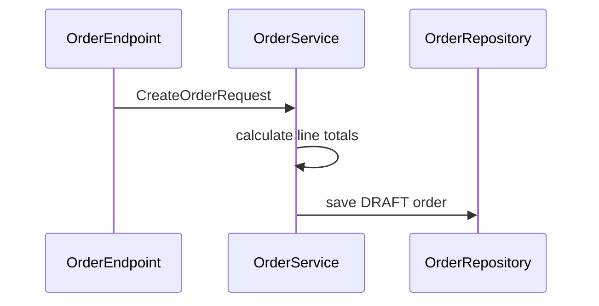
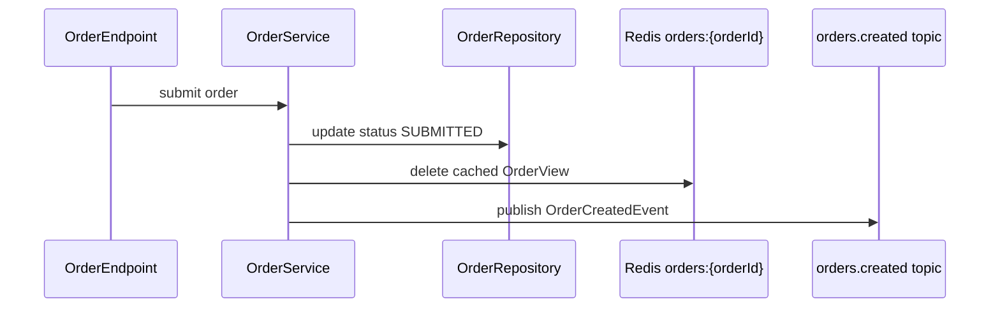
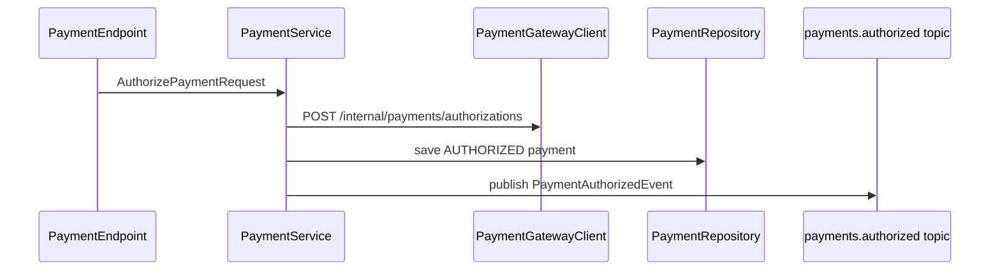
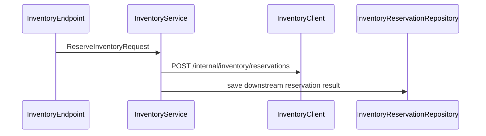
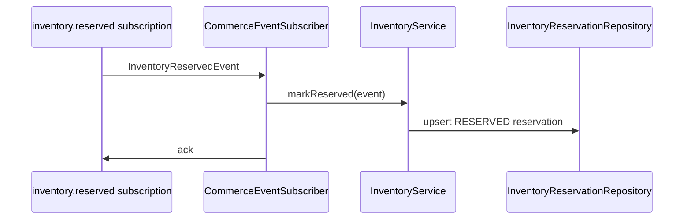
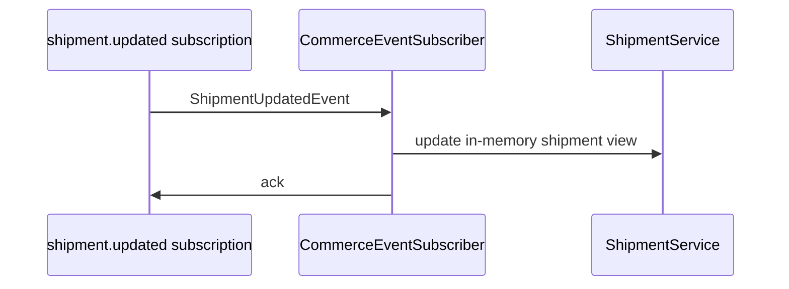
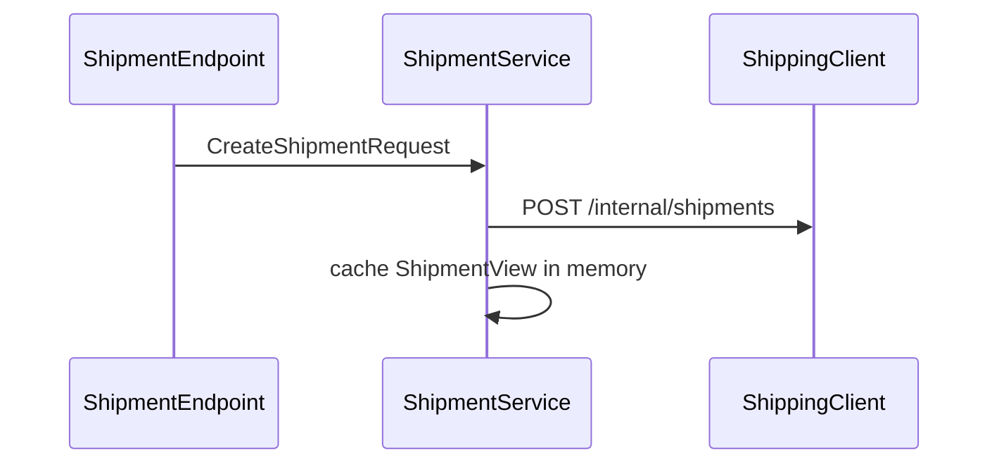
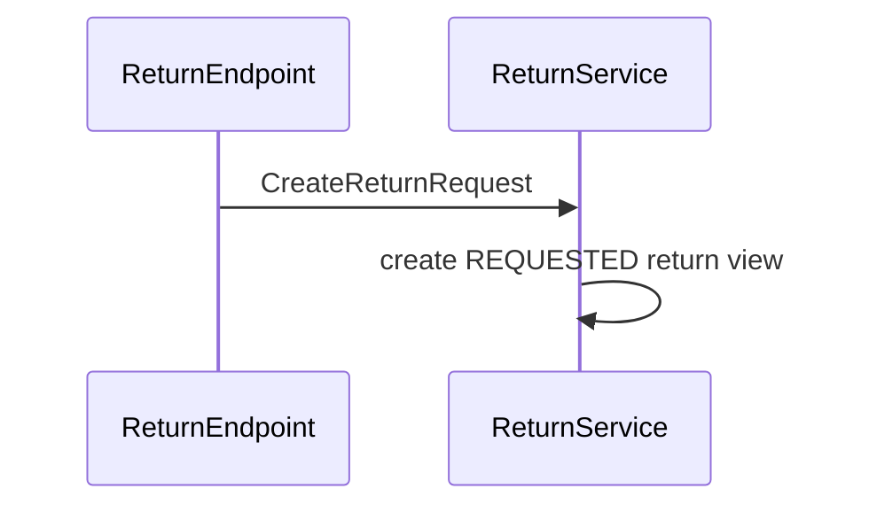
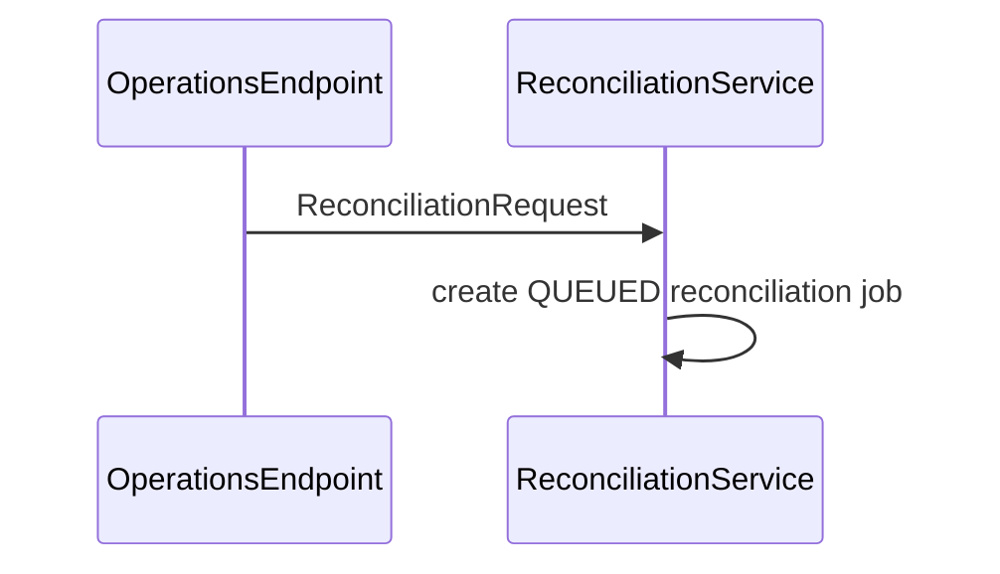

# 调用链

修改行为前先看这些链路。置信度基于静态源码扫描和配置证据。

## POST /api/v1/orders

置信度：`static`

证据：

- `endpoint/OrderEndpoint.java`
- `service/OrderService.java`
- `database/OrderRepository.java`

## POST /api/v1/orders/{orderId}/submit

置信度：`static + config`

变更清单：

- 更新订单状态相关测试。
- 检查所有环境里的 `order-created-topic` 配置。
- 保持 `OrderCreatedEvent` 向后兼容；如果不兼容，记录 consumer migration。

## POST /api/v1/payments/authorize

置信度：`static + config`

变更清单：

- 检查 `commerce.clients.payment.base-url` 和 timeout 行为。
- 修改 retry/capture 语义前，先更新下游 error mapping tests。
- 添加 event 字段前，先更新 payment event payload 文档。

## POST /api/v1/inventory/reservations

置信度：`static + config`

## inventoryReservedInputChannel

置信度：`static + pubsub`

## shipmentUpdatedInputChannel

置信度：`static + pubsub`

## POST /api/v1/shipments

置信度：`static + config`

## POST /api/v1/returns

置信度：`static`

## POST /api/v1/operations/reconciliation/jobs

置信度：`static`

