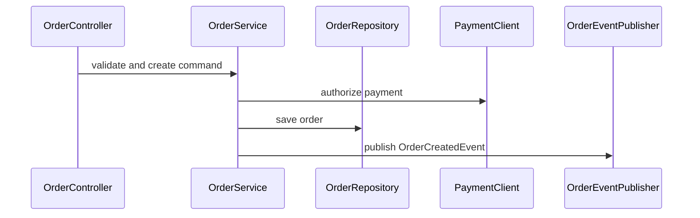
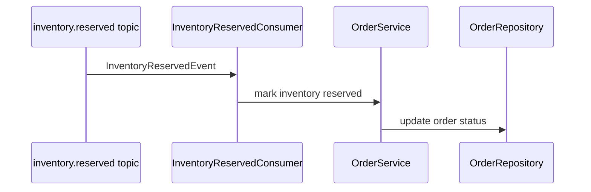

# Spring Boot 后端 AGENTS.md 组织建议

这份参考用于指导 `init-project` 在 Spring Boot 后端项目里生成 `AGENTS.md` 和 `agents/` 支撑文档。目标不是写一份人类项目 Wiki，而是给 coding agent 一张能快速定位代码、理解边界、追踪调用链的工作地图。

核心建议：根目录 `AGENTS.md` 保持短，把详细事实拆到 `agents/` 下；默认走 reference-first 渐进披露，只有任务足够宽、风险足够高、需要独立视角或并行审阅时才启用 subagents。信息按两条轴组织：

- 结构轴：endpoint、service、persistence、client、pubsub、config、test。
- 链路轴：某个入口进来后，调用哪个 service、访问哪些 repository、调用哪些下游、发布或消费哪些消息。

`subagent` 文档和 `reference` 文档要分开：

- `agents/references/technical/` 和 `agents/references/business/` 保存项目事实和可复用上下文。
- `agents/subagents/*.md` 保存角色职责、读取顺序、输出格式和协作协议。
- `.codex/agents/*.toml`、`.opencode/agents/*.md`、`.github/agents/*.agent.md` 只是薄 wrapper，用来适配 Codex、OpenCode、VS Code Copilot Chat 等不同工具的权限和调用方式。
- 对窄任务，单 agent 读取 `AGENTS.md` -> `agents/REFERENCES.md` -> 一个 focused reference -> 源码，通常更快也更省 token。
- 对宽任务，主 agent 作为 coordinator，把 endpoint/service/persistence/pubsub/integration/test/maven-runner 等 specialist 并行派出去，再合并结果。
- 做完涉及 API、数据库字段、业务规则或事件 payload 的代码变更后，同步更新受影响的 focused references，尤其是 `agents/references/business/`。陈旧的业务文档比没有文档更容易误导零上下文 agent。

## 调研结论

Spring Boot 项目的 agent 文档应该优先使用可提取事实，而不是泛泛而谈的分层规则。

可用事实来源：

- Spring MVC/WebFlux request mapping：`@RequestMapping`、`@GetMapping`、`@PostMapping` 等注解可以表达路径、HTTP method、params、headers 和 media types。参考：[Spring Framework Mapping Requests](https://docs.spring.io/spring-framework/reference/web/webmvc/mvc-controller/ann-requestmapping.html)。
- Spring Boot Actuator mappings：运行应用后，`/actuator/mappings` 能给出应用 request mappings。参考：[Spring Boot mappings endpoint](https://docs.spring.io/spring-boot/api/rest/actuator/mappings.html)。
- OpenAPI：`springdoc-openapi` 可以通过 Spring configuration、class structure 和 annotations 推断 API 语义并生成 JSON/YAML/HTML。参考：[springdoc-openapi](https://springdoc.org/)。
- Persistence：Spring Data repository interface 以 domain class 和 ID 类型绑定，通常扩展 `Repository`、`CrudRepository` 或其变体。参考：[Spring Data JPA repositories](https://docs.spring.io/spring-data/jpa/reference/repositories/definition.html)。
- Client：Spring Framework 提供 `RestClient`、`WebClient`、HTTP Service Clients 等 outbound REST client 选择。参考：[Spring REST Clients](https://docs.spring.io/spring-framework/reference/integration/rest-clients.html) 和 [Spring WebClient](https://docs.spring.io/spring-framework/reference/web/webflux-webclient.html)。
- Pub/sub：Spring Cloud Stream 建模 binder、binding、message，支持 persistent pub/sub、consumer groups、partitioning。参考：[Spring Cloud Stream](https://spring.io/projects/spring-cloud-stream/)。
- 模块边界和运行时交互：Spring Modulith 支持结构校验、模块文档、模块级集成测试、运行时交互观察。参考：[Spring Modulith fundamentals](https://docs.spring.io/spring-modulith/reference/fundamentals.html) 和 [Spring Modulith production-ready features](https://docs.spring.io/spring-modulith/reference/production-ready.html)。
- Java 调用图：静态调用图可以从 class/jar 字节码抽取，动态调用图可以用 Java agent 记录运行时调用。参考：[java-callgraph](https://github.com/gousiosg/java-callgraph)。

实践判断：

- endpoint catalog 最好来自注解扫描、OpenAPI 或 actuator mappings，不要手写猜测。
- persistence catalog 应该记录 repository、entity、table、transaction owner、query method，不要只列依赖。
- client catalog 应该记录 outbound protocol、base URL config key、timeout/retry/error mapping、调用方 service。
- pubsub catalog 应该记录 topic/queue/binding、producer/consumer、payload、idempotency、DLQ/retry。
- call chain catalog 应该同时标注 confidence：`static`、`runtime`、`inferred`、`needs-confirmation`。Spring 的代理、AOP、反射、事件和消息会让纯静态调用链不完整。

## 推荐输出结构

对 Spring Boot 后端项目，建议默认生成：

```text
AGENTS.md
agents/
  REFERENCES.md
  PROJECT_PROFILE.md
  PROJECT_EVIDENCE.md
  BUILD_AND_TEST.md
  BACKEND_SURFACES.md
  CALL_CHAINS.md
  DEPENDENCIES.md
  CODE_STYLE.md
  references/
    technical/
      endpoints.md
      services.md
      persistence.md
      pubsub.md
      integrations.md
      testing.md
      maven.md
    business/
      domain-overview.md
      business-rules.md
      events.md
  SUBAGENTS.md
  subagents/
    endpoint-specialist.md
    service-specialist.md
    persistence-specialist.md
    pubsub-specialist.md
    integration-specialist.md
    test-specialist.md
    maven-runner.md
  workflows/
    BACKEND_ANALYSIS.md
.codex/agents/*.toml
.opencode/agents/*.md
.github/agents/*.agent.md
.github/prompts/backend-analysis.prompt.md
```

`AGENTS.md` 只放入口：

```markdown
# Agent Instructions

## Project

- Maven Java Spring Boot backend service.
- Read `agents/BACKEND_SURFACES.md` before changing endpoints, clients, persistence, or messaging.
- Read `agents/CALL_CHAINS.md` before changing behavior behind an existing API or event.
- Read `agents/REFERENCES.md` first for focused technical/business context.
- Use subagents only for broad or risky cross-surface analysis; for narrow tasks, use references and source inspection sequentially.

## Commands

- Compile: `mvn compile`
- Run tests: `mvn test`
- Package: `mvn package`

## Change rules

- Keep controllers thin; put business decisions in service/application layer.
- Update tests for the layer and chain touched by the change.
- When adding or changing an endpoint, update the endpoint catalog and related call chain.
- When adding a downstream call or message publication, document timeout/retry/error/idempotency behavior.
```

`agents/BACKEND_SURFACES.md` 按结构轴组织：

```markdown
# Backend Surfaces

## Endpoints

| Method | Path | Handler | Request | Response | Auth | Tests |
| --- | --- | --- | --- | --- | --- | --- |
| POST | `/orders` | `OrderController#create` | `CreateOrderRequest` | `OrderResponse` | user token | `OrderControllerTest` |
| GET | `/orders/{id}` | `OrderController#getById` | path `id` | `OrderResponse` | user token | `OrderControllerTest` |

## Services

| Service | Role | Called by | Calls | Tests |
| --- | --- | --- | --- | --- |
| `OrderService` | order use cases | `OrderController` | `OrderRepository`, `PaymentClient`, `OrderEventPublisher` | `OrderServiceTest` |

## Persistence

| Repository | Entity | Storage | Used by | Notes |
| --- | --- | --- | --- | --- |
| `OrderRepository` | `Order` | JPA table `orders` | `OrderService` | owns order lookup and save |

## Clients

| Client | Downstream | Config key | Used by | Resilience notes |
| --- | --- | --- | --- | --- |
| `PaymentClient` | payment service | `clients.payment.base-url` | `OrderService` | timeout and error mapping required |

## Pub/Sub

| Direction | Binding/topic | Handler | Payload | Producer/consumer | Reliability notes |
| --- | --- | --- | --- | --- | --- |
| publish | `order-created-out-0` / `orders.created` | `OrderEventPublisher` | `OrderCreatedEvent` | producer | publish after order persisted |
| consume | `inventory-reserved-in-0` / `inventory.reserved` | `InventoryReservedConsumer` | `InventoryReservedEvent` | consumer | idempotent by event id |
```

`agents/PROJECT_EVIDENCE.md` 用来保存 detector、Maven inspector、Spring
inspector 等原始扫描证据。它可以稍长、偏机器可读；根目录 `AGENTS.md`
和 `BACKEND_SURFACES.md` 则保持面向 agent 阅读和行动的摘要。

`agents/CALL_CHAINS.md` 按链路轴组织：

```markdown
# Call Chains

## POST /orders

Confidence: `static + inferred`



Evidence:

- endpoint: `OrderController#create`
- service: `OrderService#createOrder`
- persistence: `OrderRepository#save`
- client: `PaymentClient#authorize`
- pubsub: `OrderEventPublisher#publishCreated`
- tests: `OrderControllerTest`, `OrderServiceTest`

Change checklist:

- If request/response changes, update API tests and OpenAPI docs.
- If payment behavior changes, update client error mapping tests.
- If persistence behavior changes, update repository/service tests.
- If event payload changes, update producer and consumer contract tests.

## inventory-reserved-in-0

Confidence: `static + config`


```

## 抽取规则建议

### Endpoint 抽取

优先级：

1. 如果项目已经有 OpenAPI 生成能力，读取或生成 `openapi.json`/`openapi.yaml`。
2. 如果能安全运行应用并开启 actuator，读取 `/actuator/mappings`。
3. 否则静态扫描 `@RestController`、`@Controller`、`@RequestMapping`、`@GetMapping`、`@PostMapping`、`@PutMapping`、`@DeleteMapping`、`@PatchMapping`。

记录字段：

- HTTP method、path、consumes、produces。
- handler class/method。
- request body、path variable、query param。
- response type。
- validation annotations。
- security annotations或 filter/interceptor 线索。
- 对应测试文件。

### Service 抽取

扫描：

- `@Service`、`@Component`、application/usecase package。
- controller 构造器注入的 bean。
- service 构造器注入的 repository、client、publisher。

记录字段：

- service class。
- public methods。
- called by 哪些 endpoint、consumer、scheduler。
- calls 哪些 repository、client、publisher、其他 service。
- transaction boundary：`@Transactional` 出现在哪一层。

建议：

- `AGENTS.md` 不要强行要求所有项目都使用 controller-service-repository 三层。
- 如果项目按 feature/package/module 组织，文档应优先尊重现有边界。
- 如果 service 很大，call chain 比“service 列表”更有用。

### Persistence 抽取

扫描：

- `JpaRepository`、`CrudRepository`、`Repository`、`ReactiveCrudRepository`。
- `@Entity`、`@Table`、`@Document`。
- `@Query`、derived query method。
- migration 文件：Flyway `db/migration`、Liquibase changelog。

记录字段：

- repository interface。
- aggregate/entity。
- storage type：JPA、Mongo、Redis、JDBC、R2DBC。
- table/collection。
- used by service。
- custom query 和风险。
- migration 文件位置。

### Client 抽取

扫描：

- `RestClient`、`WebClient`、`RestTemplate`。
- HTTP Service Client interface。
- Feign client，如果项目使用 Spring Cloud OpenFeign。
- config properties：base URL、timeout、retry、API key 名称，但不要记录 secret 值。

记录字段：

- client class/interface。
- downstream service 名称。
- method/path。
- config key。
- timeout/retry/circuit breaker/error mapping。
- tests：WireMock、MockWebServer、mock server。

### Pub/Sub 抽取

扫描：

- Spring Cloud Stream function bean：`Supplier`、`Function`、`Consumer`。
- `spring.cloud.stream.bindings.*` 配置。
- Kafka/Rabbit/Pulsar 注解或 listener：`@KafkaListener`、`@RabbitListener` 等。
- event publisher：`StreamBridge`、`ApplicationEventPublisher`、KafkaTemplate、RabbitTemplate。

记录字段：

- direction：publish 或 consume。
- binding/topic/queue。
- handler。
- payload class。
- producer/consumer service。
- retry、DLQ、consumer group、partition key。
- idempotency key 和重复消息处理。

### 调用链抽取

调用链最好用“多证据合成”，不要只靠单一静态扫描。

证据层级：

1. `runtime`：OpenTelemetry trace、Spring Modulith observability、集成测试 trace。
2. `framework-runtime`：actuator mappings、Spring bean graph、OpenAPI。
3. `static`：Java AST、字节码 call graph、构造器注入关系。
4. `config`：application.yml、stream bindings、client properties。
5. `inferred`：命名和包结构推断。

生成 `CALL_CHAINS.md` 时，每条链路都标注：

```markdown
Confidence: `runtime`
Evidence sources:
- `trace/order-create.json`
- `openapi.yaml`
- `src/main/java/.../OrderController.java`
```

如果证据不足，明确写：

```markdown
Confidence: `needs-confirmation`
Missing evidence:
- downstream timeout behavior was not found
- event consumer tests were not found
```

## 对 AGENTS.md 的具体建议

根目录 `AGENTS.md` 应该包含：

- 项目一句话定位。
- 核心命令。
- reference-first 加载规则：先读 `agents/REFERENCES.md`，再选 focused reference，最后看源码。
- 哪里看结构轴：`agents/BACKEND_SURFACES.md`。
- 哪里看链路轴：`agents/CALL_CHAINS.md`。
- 何时使用 subagents：宽面分析、高风险变更、跨层影响、需要独立审阅。
- 修改规则：改 endpoint、repository、client、pubsub、event payload 时分别要更新什么。

根目录 `AGENTS.md` 不建议包含：

- 完整 endpoint 列表。
- 完整依赖树。
- 大段泛用 Spring 最佳实践。
- 推测出来但没有证据的调用链。
- tool-specific subagent wrapper 的大段配置。

原因：AGENTS.md 是第一加载面，应该指导 agent 去正确的证据文件，而不是一次性塞满所有细节。

## Subagent 组织建议

推荐角色名使用 `*-specialist`，表示负责面而不是只读权限。例如：

- `endpoint-specialist`：HTTP route、request/response、validation、OpenAPI、endpoint tests。可以在 wrapper 允许且父任务明确要求时做 endpoint 层实现。
- `service-specialist`：业务编排、状态流转、异常、transaction boundary。
- `persistence-specialist`：entity、repository、migration、Postgres/profile config。
- `pubsub-specialist`：topic/config、payload、publish timing、retry/DLQ、idempotency。
- `integration-specialist`：下游 client、外部系统、timeout/retry/error mapping。
- `test-specialist`：JUnit 5、Mockito、Reactor/WebTestClient、JaCoCo、Checkstyle。
- `maven-runner`：唯一默认允许执行 Maven 验证命令的角色，不编辑文件。

每个 specialist 必须先读 `agents/SUBAGENTS.md` 和自己的
`agents/subagents/*.md`，然后按 `agents/REFERENCES.md` 选择 focused
reference。读完 reference 后，还要检查 reference 里列出的源码文件；不能只读
reference 就给高置信结论。

Subagent 的收益是并行和独立视角，成本是重复上下文、更多 token、结果合并开销。
因此默认策略是：窄任务先单 agent + references；宽任务再 coordinator +
specialists。

## 生成器落地建议

给 `init-project` 增加 Spring Boot 后端 inspector，可以输出：

```json
{
  "backendSurfaces": {
    "endpoints": [],
    "services": [],
    "repositories": [],
    "clients": [],
    "pubsub": []
  },
  "callChains": [],
  "evidence": {
    "openapi": null,
    "actuatorMappings": null,
    "staticScan": [],
    "configFiles": []
  }
}
```

分阶段实现：

1. 先做静态扫描：controllers、services、repositories、clients、stream bindings。
2. 再做结构文档：生成 `BACKEND_SURFACES.md`。
3. 再做候选调用链：从 controller -> injected service -> injected repository/client/publisher。
4. 加 confidence 标记，不确定就写 `inferred` 或 `needs-confirmation`。
5. 如果项目能运行，再接入 actuator mappings、OpenAPI 或 runtime trace 作为更强证据。
6. 最后考虑 Spring Modulith 或 ArchUnit，把模块边界变成可验证规则。

## 反模式

- 只按 controller/service/repository 三层列目录，不写具体入口和下游关系。
- 把所有 Spring 最佳实践放进 `AGENTS.md`，导致未来 agent 每次都加载无关内容。
- 生成看似确定的调用链，但没有标注证据来源。
- 忽略消息系统，导致 HTTP 链路之外的业务行为丢失。
- 忽略 outbound client 的 timeout、retry、error mapping。
- 把 secrets、token、真实密码写进 agent 文档。

## 最小可用版本

如果只能先实现一个版本，建议生成这三份：

```text
AGENTS.md
agents/REFERENCES.md
agents/BACKEND_SURFACES.md
agents/CALL_CHAINS.md
```

其中：

- `AGENTS.md` 负责告诉 agent 先读哪份文件。
- `REFERENCES.md` 负责把 technical/business 上下文拆成可渐进加载的索引。
- `BACKEND_SURFACES.md` 负责按 endpoint、service、persistence、client、pubsub 列事实。
- `CALL_CHAINS.md` 负责按业务入口列链路，并给每条链路标注证据和置信度。
